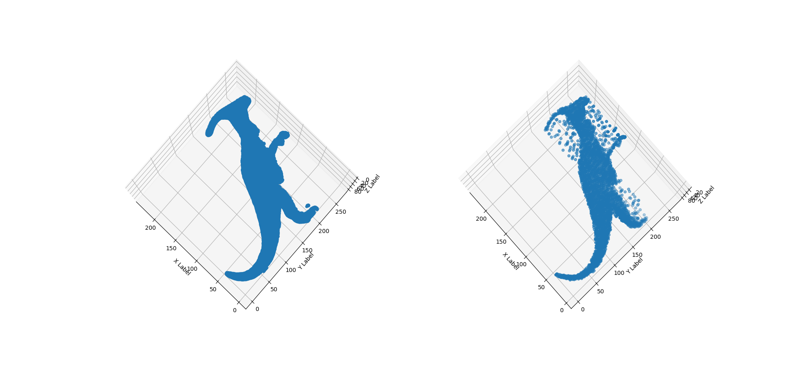

# point-cloud-compression
   
## Point-cloud compression algorithms for HKUST EESM-5547 Course Project   

The idea of 3D-DCT Compression method can be found in: 
[Point-Cloud compression using data independent method — A 3D discrete cosine transform approach](https://ieeexplore.ieee.org/document/8078873)   
The idea of Octree-based Compression method can be found in:
[Octree-based point-cloud compression](https://dl.acm.org/doi/10.5555/2386388.2386404)

